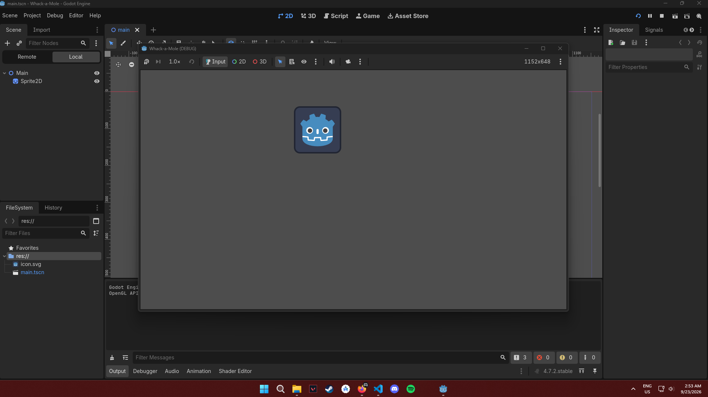
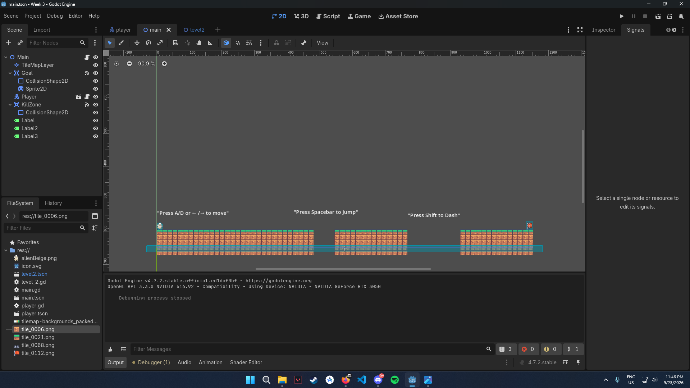

Whack-a-Mole is a pretty self explanatory game where, like the arcade version, users try to whack, or in this case, 
click moles as they randomly pop up from a hole. There will be a time limit. It is basically like an aim trainer since
I play a lot of aim-focused games, but since those are too common already, I decided to mix it up and make it into this
Whack-a-Mole game.

Week 1:

Week 2:

Week 3:

.png)

.png)

.png)